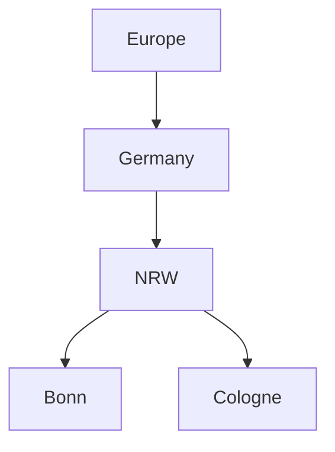

# PLAB2WS20-RuppaSur

This project contains the files pertaining to the Programming Lab II.
# My README Edit

## Practicing Markdowns


*I am writing for a italic text*

**I am writing for a bold text**

_I am trying to **combine** them_

~~I am trying to create strikethrough effect~~

## Unordered list
* Item 1
* Item 2
  * Item 2a
  * Item 2b
  
## Ordered list
1. Item 1
2. Item 2
3. Item 3
    1. Item 3a
	2. Item 3b
4. Item 4
5. Item 5
  
## Practicing Multiline Blockquote
>>>
I am trying to make multiple lines

without having to manually prepend `>` to every line!
>>>

## Code and Syntax Highlighting


This statement is used for `highlighiting` specific part.
  

```python
def function():
    #indenting works just fine in the fenced code block
    s = "Python syntax highlighting"
    print s
```

## Tables

| header 1 | header 2 |
| -------- | -------- |
| cell 1   | cell 2   |
| cell 3   | cell 4   |

## Newlines

Roses are red

Violets are blue

**Sugar** is *white*

## Multiple underscores in words


trying_to_make_underscored_words

## Emoji

I study  🖥️ 🧬   at 🇩🇪. 
I referred the [Emoji Cheat Sheet](https://www.emojicopy.com) for a list of all supported emoji codes. 👨‍💻. 

 

## Tasks list

- [x] Completed task
- [ ] Incomplete task
  - [ ] Sub-task 1
  - [x] Sub-task 2
  - [ ] Sub-task 3

1. [x] Completed task
1. [ ] Incomplete task
   1. [ ] Sub-task 1
   1. [x] Sub-task 2

## Colors

`#F00`
`#F00A`
`#FF0000`
`#FF0000AA`
`RGB(0,255,0)`
`RGB(0%,100%,0%)`
`RGBA(0,255,0,0.7)`
`HSL(540,70%,50%)`
`HSLA(540,70%,50%,0.7)`

## Mermaids

```
```

